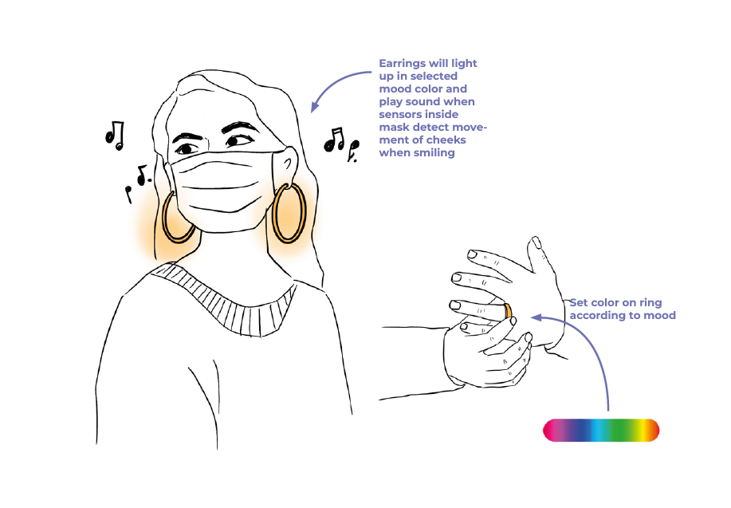
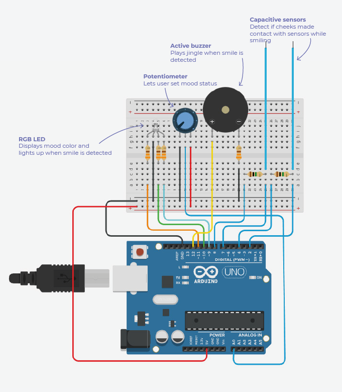
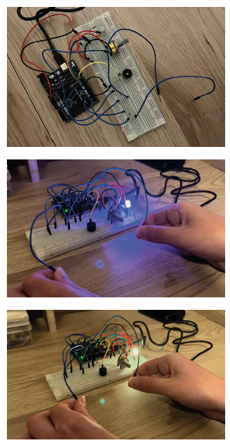
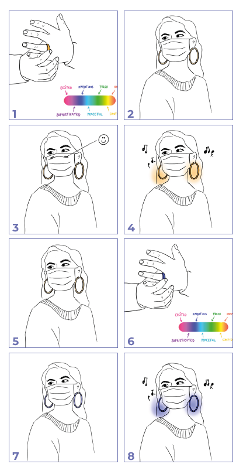

# Challenge

In the wake of the COVID-19 pandemic, we have all become accustomed to wearing masks in public and private settings. While we can appreciate the added safety this practice brings, undeniably the down-side is that we may find it more difficult to express ourselves, and to 'read' the expressions of others, both because of attenuated (masked) facial expressions, and the increased muffling of our voices. Additionally, masks can prevent the hard of hearing from lip-reading.

What opportunities are there for the use of interactive, artefact-based or wearable technology to enhance our human-human communication [while we continue to use masks to protect ourselves and others from airborne viruses]?

Design an Arduino based wearable or standalone design object that can display a range of indicators of mood, emotion, or 'reaction' such as agreement, disagreement, joy, sadness, confusion, anger, disapproval, salutation etc... The wearable or object can be a mask, sculptural object, jewelry, a hat, scarf etc... [if you are unsure, please ask]

As with all assignments, pushing the boundaries of the brief will potentially add bonus points. Ask yourself these questions and see where you can add depth and functionality to your project:

1. Can you think of an original input system? (hands-free? gestural? other?)

2. Could you incorporate sound or sound-detection into the system? (voice recognition is beyond the scope of this assignment)

3. Can you actually build your prototype / circuit? If not a prototype with the actual circuit, can you make a paper prototype or a 3d model of your wearable / object at size 1:1 for demonstration?

4. Have you constructed/documented a 'cognitive walkthrough' of the prototype?

Note: For this first challenge you DO NOT need to present an actual fabricated physical prototype, nor do you have to buy additional sensors; you just have to speculate on the build. Even though there is no need to actually fabricate or build the wearable, you should design it  — with sketches and/or renders &/or paper prototypes. You can speculate on the ergonomics of your design, the human-computer-interface (HCI) as well as the materials and methods of fabrication. Consider also possible power sources, how/where will they be incorporated?

You DO need to either actually or virtually build your circuit design, to test your programming. Therefore, your code and circuit should be plausible — you are encouraged to use TinkerCAD to develop and test this Challenge. You are encouraged to independently seek out new code commands, especially to extend the brief.

# Design

The idea behind the design is that a ring works as the input device with which the wearer can select his/her current mood and depending on this the colour of the earrings (or other weareble device/jewelry) changes. A second input device is the mask, which will detect if the wearer is smiling underneath it. Whenever a smile is being detected the earrings will light with more intense brightness and a little jingle will be played to add sound to the interaction.

# Code

The arduino code can be found [here!](Assignment_1.ino)

# Circuit diagram and wiring

### Component selection

### INPUT
#### Selecting mood: Potentiometer
To select a mood, I decided to use a potentiometer as input. Potentiometers are variable resistors and change their resistance when the dial is being turned. Depending on how far the dial is turned, a different voltage amount is applied to the pin which can then be read as an analog value that can be mapped to PWM (pulse width modulation) in order to for example change the color of a LED (Instructables, 2017).
#### Detecting touch: wires as capacitive sensors
Instead of using a complex a complex facial sEMG (surface electromyography) system, as suggested in the research part about detecting smiles, I decided to use capacititive touch sensors that can detect touch when the cheeks are raised underneath the mask while smiling. Capacitive sensors can sense the electrical capacitance of the human body (Arduino, n.d.). A simple wire can be used as a capacitive touch sensor. I decided to use 2 wires, to detect both the right and left cheek.

### OUTPUT
#### Display varying colors: RGB LED
As I want to be able to display a full range of colors to reflect the wearer’s mood, I decided to use an RGB LED. An RGB LED consists of three colour LEDs: red, green
and blue. By mixing those together, many other colors can be created (Arduino Project Hub, n.d.). 
#### Play a sound: active piezo buzzer
To play sound, when a smile is detected, a sound output device is needed. For this, an active piezo buzzer is chosen. Metal film inside the buzzer is vibrating which
causes the resulting sound waves (Campbell, 2021).

### Circuit diagram

# Final working prototype

A video of the final working prototype can be found [here!](https://youtu.be/-9-NCaHEes4)

# Walkthrough

Emma is wearing the devices, which are the mood ring, the mask and the earrings. Depending on how she feels, Emma can change the mood on her ring by sliding it around her finger. Right now she is feeling confident, so she is setting the mood to that (1). Now her earrings light up in the corresponding colour with 50% brightness (2). The capacitive sensors inside her mask are identifiying whether Emma is smiling, by checking whenever both sensors are exceeding the set threshold (3). When that is the case, the earrings light up with 100% brightness and a little happy jingle is being played (4). The lighting up and jingle last for a short time, before returning to the previous state with 50% brightness (5). Whenever Emma feels that her mood changes, she can set the ring to a new status (6), and her earrings will change color accordingly (7). This will also reflect when Emma is detecting laughing again, then the earrings will light up in the new mood colour (8).
